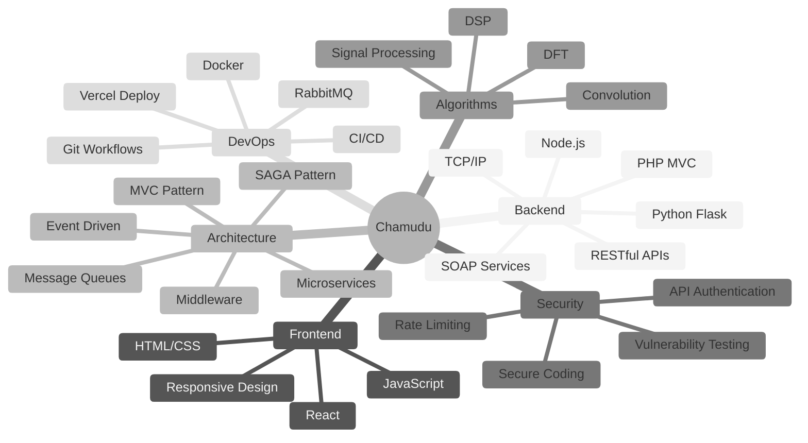

<div align="center">
  
</div>

<div align="center">
  
  ### 🎓 CS Undergraduate | 💻 Full-Stack Developer
  
  *CS student at University of Colombo School of Computing — building web apps and backend systems*
  
  [](https://portfolio-chamu.vercel.app)
  [](mailto:chamuduhansana@gmail.com)
  [](https://www.linkedin.com/in/chamudu-h-367b18281)
  
  
  
</div>

---

## 💻 Tech Arsenal

<div align="center">

### 🎨 Frontend Development


### ⚙️ Backend Development


### 🔌 IoT & Embedded


### 📡 Protocols & Message Brokers


### 🗄️ Database


### 🛠️ Tools & DevOps


</div>

---

## 📊 GitHub Analytics

<div align="center">
  
  
</div>

<div align="center">
  
</div>

<div align="center">
  
</div>


---

## 🏆 Featured Projects

<div align="center">

### 🌟 Flagship Project

</div>

<table>
<tr>
<td width="50%">

### 🏥 [VillageCare](https://github.com/Chamudu/VillageCare)

<a href="https://villagecare-lk.vercel.app">
  
</a>

**A comprehensive village management platform for Sri Lankan Grama Niladhari officers**

#### ✨ Highlights
- 📊 **Real-time Analytics Dashboard**
- 👥 **Smart Resident Management** with NIC validation
- 📜 **Digital Certificate Processing**
- 🗺️ **GPS Location Tracking** (Leaflet.js)
- 💬 **Complaint System** with priority management
- 📱 **Responsive Design** for mobile & desktop
- 🔐 **Multi-role Authentication** (GN, DS, Villager)

#### 🛠️ Tech Stack
```
PHP MVC • MySQL • JavaScript • Leaflet.js • Vercel
```

#### 📈 Impact
- **13 Active Branches** for feature development
- **Deployed on Vercel**
- **University group project**

<a href="https://github.com/Chamudu/VillageCare">
  
</a>

</td>
<td width="50%">

### 🤖 [AI Task Manager](https://github.com/Chamudu/ai-task-manager)

**Task management web application**

#### ✨ Features
- 📋 Task categorization and filtering
- 📅 Due date management
- 📊 Analytics dashboard
- ⚡ Real-time updates

#### 🛠️ Built With
```
React • Node.js • Express • MongoDB
```

---

### 📚 [NexusEnroll](https://github.com/Chamudu/NexusEnroll)

**Microservices-based course enrollment platform**

#### ✨ Features
- 🏗️ Microservices architecture
- 📝 Student & course management
- 📊 Complete documentation
- 🔍 Error handling and logging

#### 🛠️ Built With
```
Python • Flask • MySQL • Microservices
```

---

### 🔄 [PubSub Middleware](https://github.com/Chamudu/pubsub-middleware)

**Event-driven messaging system**

#### ✨ Features
- 📡 Distributed messaging
- 🔄 Pub/Sub pattern
- ⚡ Async message delivery

#### 🛠️ Built With
```
Python • Event-Driven Architecture
```

---

### 🛡️ [SecureHome](https://github.com/Chamudu/SecureHome)

**Real-time IoT security dashboard for ESP32**

<a href="https://secure-home-inky.vercel.app">
  
</a>

#### ✨ Features
- 🔒 Real-time security monitoring
- 🌡️ Environmental sensors tracking
- 👤 Presence detection system
- 📡 MQTT communication
- 📱 Responsive dashboard

#### 🛠️ Built With
```
Arduino • ESP32 • MQTT • HTML/CSS/JS
```

---

### 🚛 [SwiftLogistics](https://github.com/Chamudu/SwiftLogistics)

**Middleware platform with multi-protocol integration**

#### ✨ Features
- 🏗️ Microservices architecture with RabbitMQ
- 📡 Multi-protocol support (REST, SOAP, TCP/IP)
- 🔐 JWT Auth & API Gateway
- 📊 SAGA pattern for distributed transactions
- ⚡ Real-time tracking with WebSockets
- 📈 React Dashboard

#### 🛠️ Built With
```
Node.js • React • RabbitMQ • PostgreSQL • Socket.IO • Docker Compose
```

#### 📈 Architecture Highlights
- **14+ Services**: API Gateway, Workers, Adapters
- **3 Protocol Adapters**: REST, SOAP, TCP/IP
- **Event-Driven Design**: Message queues & pub/sub

</td>
</tr>
</table>

---

## 🎓 Additional Projects

<div align="center">

| Project | Description | Tech Stack | Year |
|---------|-------------|------------|------|
| **[PHP MVC Framework](https://github.com/Chamudu/PHPmvc_frameWork)** | Custom MVC framework from scratch | PHP, MySQL | 2025 |
| **[Portfolio](https://github.com/Chamudu/Portfolio)** | Personal portfolio website | HTML, CSS, JS | 2026 |
| **[c-parser](https://github.com/Chamudu/c-parser)** | Recursive descent parser | C | 2024 |

</div>

---

## 🔬 Algorithms & Security Projects

<div align="center">

| Project | Focus Area | Tech Stack | Highlights |
|---------|------------|------------|------------|
| **[DSP Algorithms](https://github.com/Chamudu/DSP_Convolution_and_DST)** | Signal Processing | Python, NumPy, DSP | Convolution & DFT from scratch |
| **[c-parser](https://github.com/Chamudu/c-parser)** | Compilers | C | Lexer and parser implementation |
| **[MVC Framework](https://github.com/Chamudu/MVC_T1)** | Architecture | PHP | Custom MVC implementation |

</div>

---

## 💼 Core Competencies

<div align="center">




</div>


---

## 📈 Contribution Graph

<div align="center">
  


</div>


## 📚 Recent Focus Areas

<div align="center">

```diff
+ 🔥 Building production-ready enterprise systems
+ 🏗️ Mastering microservices & middleware architecture
+ 🔐 Implementing security-first development practices
+ 📡 Multi-protocol API integration (REST/SOAP/TCP)
+ 🧮 Algorithm design & signal processing
+ 🗺️ Advanced GIS and mapping solutions
```

</div>

---

## 🤝 Let's Collaborate!

<div align="center">

I'm always excited to work on interesting projects and connect with fellow developers!

### 💬 Open to:
✨ **Open Source Contributions** • 🤝 **Collaboration on Projects** • 💼 **Freelance Opportunities** • 🎓 **Knowledge Sharing** • 🚀 **Innovative Ideas**

---

### 📬 Get In Touch

<a href="http://portfolio-chamu.vercel.app/">
  
</a>
<a href="mailto:chamuduhansana@gmail.com">
  
</a>
<a href="https://www.linkedin.com/in/chamudu-h-367b18281">
  
</a>
<a href="https://github.com/Chamudu">
  
</a>

</div>

---

<div align="center">
  
  ### 💙 Thank you for visiting!
  
  
  
</div>
